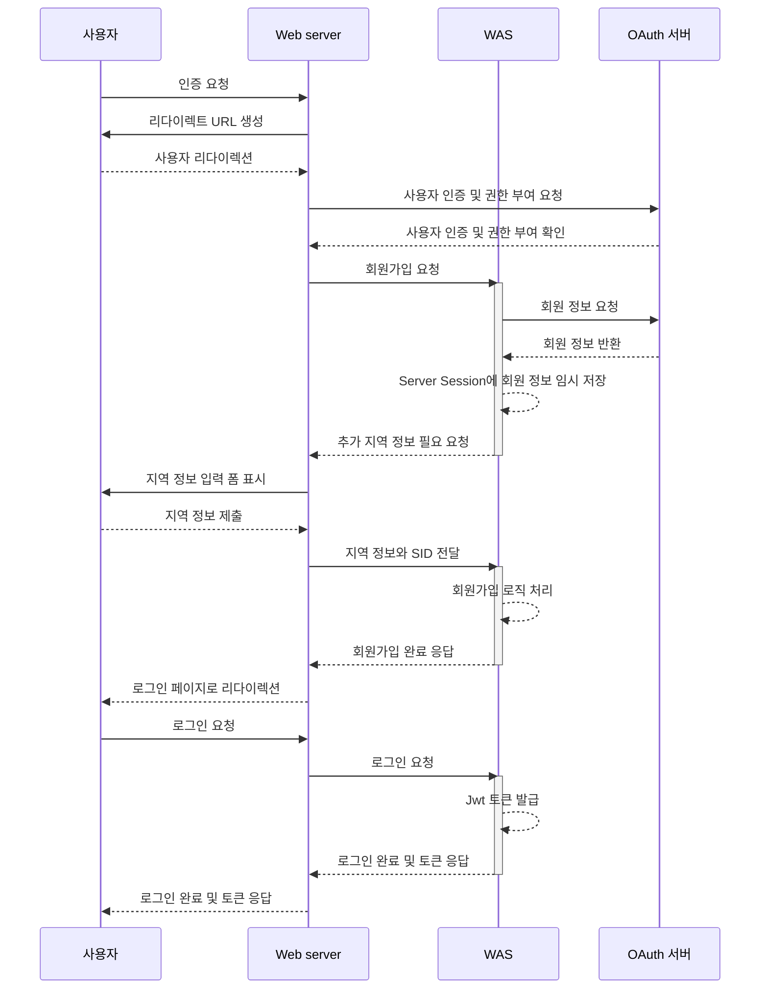
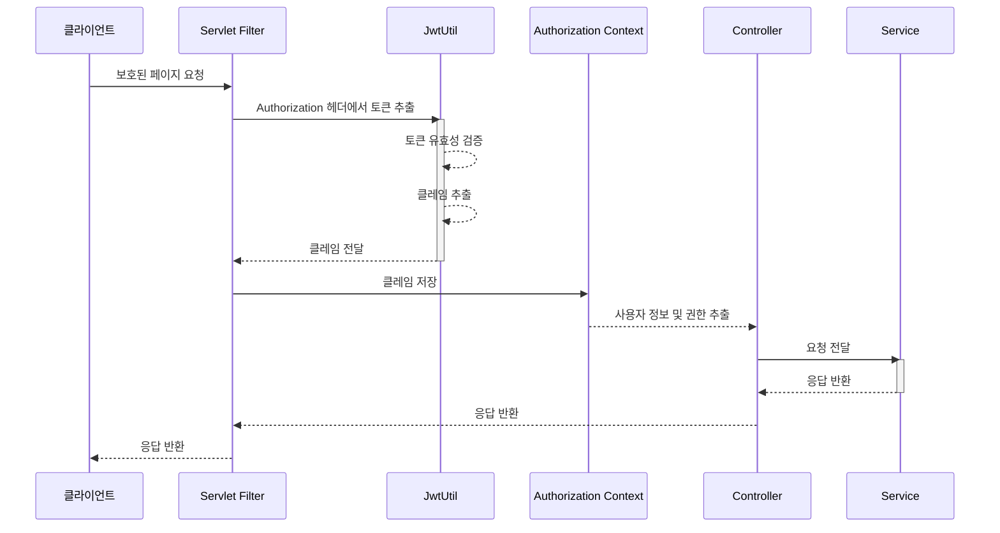
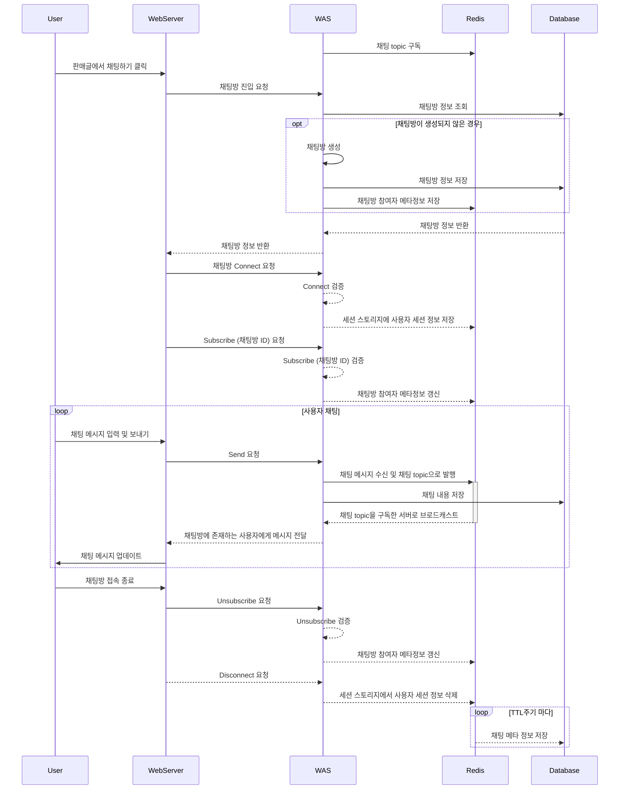
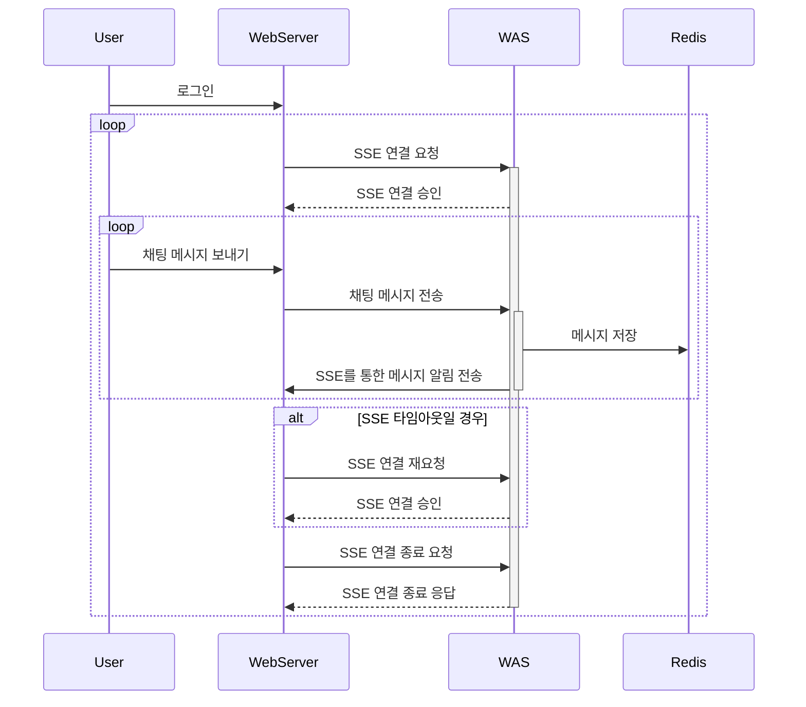

# 👫 Secondhand

<p align="center"></p>

## 프로젝트 소개
>  진행기간 : 2023. 06 ~ 2023. 08

//TODO 간단한 프로젝트 설명과 동기

| 이린 | Dewey |
|:--:|:--:|
|||

---
## 프로젝트 구조
```java
src
├── main
│   ├── java.com.team5.secondhand
│   │    ├── api    // 외부 API
│   │    │   └── s3 // 이미지 호스팅
│   │    ├── application    // 기본 API
│   │    │   ├── chatroom   // 채팅방 관련 패키지
│   │    │   ├── item       // 판매 상품 관련 패키지
│   │    │   ├── member     // 회원 관련 로패키지직
│   │    │   ├── oauth      // oauth 관련 패키지
│   │    │   ├── region     // 지역 관련 패키지
│   │    │   ├── resource   // 초기 데이터 반환 패키지
│   │    │   └── wishlist   // 좋아요 표시한 상품 관련 패키지
│   │    ├── chat              // 채팅 API
│   │    │   ├── bubble        // 채팅메시지
│   │    │   ├── chatroom      // 채팅metainfo
│   │    │   └── notification  // 채팅 알람
│   │    └── global
│   │        ├── auth
│   │        ├── config
│   │        ├── exception
│   │        ├── model
│   │        ├── properties
│   │        └── util
│   └── resources
└── test
    └── java.com.team5.secondhand
        ├── integration    // 통합테스트
        └── unit           // 단위테스트
```

---
## 구성도
### 인프라 구성


### RDB 구성
//TODO 듀이

---
## API 엔드포인트 목록
- 자세한 내용은 문서를 참고하세요. [링크](https://documenter.getpostman.com/view/27928775/2s9Y5Wy4Jc)

<details><summary>계정 및 인증 (Authentication and Account)</summary>
 
| 설명                                     | HTTP 메서드 | 엔드포인트                    |
|------------------------------------------|-------------|------------------------------|
| 사용자는 로그아웃 할 수 있다.             | GET         | /logout                      |
| 사용자는 OAuth를 통해 로그인 할 수 있다.  | GET         | /git/login?code={string}&env={PROD} |
| 사용자는 회원가입을 할 수 있다 (Github/일반 가입). | POST | /join |
| 사용자는 아이디 중복확인을 할 수 있다.     | GET         | /join/availability?memberId={memberId} |
| 사용자는 로그인을 할 수 있다.             | POST        | /login                       |
| 사용자는 프로필 사진을 설정할 수 있다.    | PATCH       | /members/image               |

</details>

<details><summary>상품 관리 (Item Management)</summary>

| 설명                                       | HTTP 메서드 | 엔드포인트                             |
|--------------------------------------------|-------------|---------------------------------------|
| 사용자는 새로운 상품을 등록할 수 있다.    | POST        | /items                               |
| 판매자는 상품 정보를 수정할 수 있다.     | PUT         | /items/{id}                          |
| 사용자는 상품의 상세 정보를 볼 수 있다.  | GET         | /items/{id}                          |
| 판매자는 판매중인 판매 상품 목록에서 글을 삭제할 수 있다. | DELETE | /items/{id}                          |
| 판매자는 상품 판매 상태만 별도로 수정할 수 있다. | PATCH | /items/{id}/status                  |
| 사용자는 자신의 동네의 상품 목록을 볼 수 있다. | GET | /items?page={number}&region={id}    |
| 사용자는 자신의 동네의 상품 목록을 특정 카테고리별로 볼 수 있다. | GET | /items?page={number}&region={id}&category={id} |
| 사용자는 자신의 동네의 판매중인 카테고리 목록을 볼 수 있다. | GET | /items/categories?regionId={id}   |
| 사용자는 상품 이미지를 첨부할 수 있다.    | POST        | /items/image                         |
| 사용자는 자신이 판매완료한 상품 목록을 볼 수 있다. | GET | /items/mine?page={number}&isSales={boolean} |
| 사용자는 자신이 판매중인 상품 목록을 볼 수 있다. | GET | /items/mine?page={number}&isSales={boolean} |

</details>

<details><summary>채팅 (Chat)</summary>

| 설명                                       | HTTP 메서드 | 엔드포인트                            |
|--------------------------------------------|-------------|--------------------------------------|
| 구매자는 판매자에게 판매상품에 대한 채팅을 생성할 수 있다. | POST | /chats                           |
| 사용자는 나의 채팅 내역을 모두 볼 수 있다. | GET | /chats?page={number}&itemId={number} |
| 사용자는 아이템 상세보기에서 채팅방에 입장할 수 있다. | GET | /chats/items/{itemId}             |
| 사용자는 나의 채팅 내역의 알림을 받을 수 있다. | GET | /chats/subscribe                   |
| 사용자는 채팅방에서 나갈 수 있다 (삭제). | DELETE | /chats/{chatId}                  |
| 사용자는 대화하던 채팅방에 다시 입장할 수 있다. | GET | /chats/{chatId}                   |
| 사용자는 아이템에 대한 이전 채팅 로그를 알 수 있다. | GET | /chats/{chatId}/logs?page={number} |

</details>

<details><summary>실시간 채팅 (Live Chat)</summary>

- 웹소켓 프로토콜입니다.

| 설명                            | 엔드포인트                     |
|-------------------------------|------------------------------|
| 사용자는 채팅 소켓을 연결할 수 있다. | /chat                          |
| 사용자는 채팅방에 입장할 수 있다. (subscribe) | /sub/{chatroomId} |
| 사용자는 채팅방에 메시지를 보낼 수 있다. (publish) | /pub/message             |
 
</details>

<details><summary>상품 관심 등록 (Wishlist)</summary>

| 설명                                       | HTTP 메서드 | 엔드포인트                             |
|--------------------------------------------|-------------|---------------------------------------|
| 사용자는 관심상품으로 등록한 글의 목록 전체를 볼 수 있다. | GET | /wishlist?page={number} |
| 사용자는 관심상품으로 등록한 글의 목록을 카테고리별로 볼 수 있다. | GET | /wishlist?page={number}&category={id} |
| 사용자는 관심상품으로 등록한 아이템의 카테고리 목록을 볼 수 있다. | GET | /wishlist/categories |
| 사용자는 상품을 관심상품으로 등록할 수 있다 (좋아요 누르기). | POST | /wishlist/like |
| 사용자는 관심상품을 관심상품 목록에서 삭제할 수 있다 (좋아요 해제). | DELETE | /wishlist/like?itemId={number} |

</details>


<details><summary>리소스 및 기타 (Resources and etc...)</summary>

| 설명                                       | HTTP 메서드 | 엔드포인트                             |
|--------------------------------------------|-------------|---------------------------------------|
| 사용자는 동네 명단을 볼 수 있다. | GET | /regions?address={string} |
| 초기 데이터를 받을 수 있다. | GET | /resources |
| 사용자는 카테고리 리소스 정보를 받을 수 있다. | GET | /resources/categories |

 </details>

---
## 주요 기능
### 기능1. OAuth2.0을 적용한 회원가입 및 회원 인증 절차
- 사용자 데이터에 대한 보안과 편의성을 위해 OAuth 2.0을 사용하여 회원가입을 할 수 있도록 구현하였습니다.
- OAuth 서버를 통해 사용자 인증을 완료한 후, 잠시 session에 이 데이터를 저장합니다. 사용자로부터 추가로 필요한 지역 정보를 입력받아 회원가입을 완료하고 이 정보를 데이터베이스에 저장합니다.
- OAuth 서버 인증 이후 유효시간 30분 이후에 추가 정보 입력을 시도할 경우, 예외가 발생하여 처음부터 다시 처음부터 가입 절차를 거쳐야 합니다.

#### OAuth 회원가입 및 로그인 Sequence Diagram


#### 사용자 권한이 필요한 요청을 했을 때 Sequence Diagram
- 사용자 권한 이 필요한 요청을 했을 때 다음과 같이 요청마다 사용자 정보를 `Authorization` header에서 추출하여 사용합니다.



---

### 기능2. 실시간 채팅 및 알람 구조
- 실시간 채팅을 하기 위해서 STOMP 프로토콜과 Redis Pub/Sub 을 활용하여 채팅 기능을 구현하였습니다.
- CONNECT 요청마다 사용자 정보를 `Authorization` header에서 추출하여 사용합니다.
- Web Socket 연결 중에 예외 발생 시, 해당 연결은 Disconnect 되고 처음부터 다시 연결 시도를 해야합니다. (예외 발생 경우 몇 개 있는데 다 적어야하나? stomp 구조에 맞지 않은 요청이 들어오거나, 인증되지 않은 사용자거나, 경로가 잘못되거나 등등)
- 영구적인 저장이 필요없는 채팅방 참여자 상태 정보는 Redis 에 캐시로 저장되고, 영구적인 저장이 필요한 채팅방 정보와 메시지는 데이터베이스에 저장합니다.

#### 채팅 흐름 Sequence Diagram



#### 채팅 알람 Sequence Diagram

- 사용자가 WebSocket 연결이 끊겨도 채팅 알람을 받기 위해 SSE를 활용하여 채팅 알람 기능을 구현하였습니다.


### 기능3. 


---
## 🧑🏻‍💻 기술스택


   


